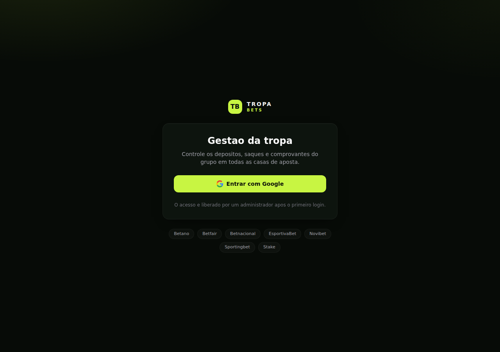

# Peçanha Affiliates — Gestão coletiva de apostas esportivas

Aplicação web full-stack para um grupo de amigos acompanhar **depósitos, saques e comprovantes**
em 7 casas de aposta, com **login exclusivo pelo Google**, **aprovação manual de novos membros**
e **painel administrativo**.

| | |
| --- | --- |
| **Framework** | Next.js 15 (App Router + Route Handlers) + TypeScript |
| **Estilo** | Tailwind CSS (tema escuro com acento lima) |
| **Banco / Auth / Arquivos** | Supabase (PostgreSQL + Auth com Google + Storage) |
| **Arquitetura** | MVC — Models · Services/Controllers · Views |
| **Deploy** | Vercel |



---

## Sumário

1. [O que você vai precisar](#1-o-que-você-vai-precisar)
2. [Baixar e abrir o projeto](#2-baixar-e-abrir-o-projeto)
3. [Criar o projeto no Supabase](#3-criar-o-projeto-no-supabase)
4. [Rodar o script SQL (banco, RLS, triggers e storage)](#4-rodar-o-script-sql)
5. [Criar as credenciais OAuth no Google Cloud](#5-criar-as-credenciais-oauth-no-google-cloud) · [erro `redirect_uri_mismatch`](#54-erro-400-redirect_uri_mismatch)
6. [Ativar o provider Google no Supabase](#6-ativar-o-provider-google-no-supabase)
7. [Configurar as URLs de redirecionamento](#7-configurar-as-urls-de-redirecionamento)
8. [Copiar as chaves e criar o `.env.local`](#8-copiar-as-chaves-e-criar-o-envlocal)
9. [Instalar as dependências e rodar](#9-instalar-as-dependências-e-rodar)
10. [Primeiro acesso: virar administrador](#10-primeiro-acesso-virar-administrador)
11. [Usando o painel administrativo](#11-usando-o-painel-administrativo)
12. [Usando o painel do usuário](#12-usando-o-painel-do-usuário)
13. [Deploy na Vercel](#13-deploy-na-vercel) · [erro `No API key found`](#1331-se-aparecer-no-api-key-found-in-request)
14. [Estrutura do projeto (MVC)](#14-estrutura-do-projeto-mvc)
15. [Modelo de dados](#15-modelo-de-dados)
16. [Segurança (RLS, storage e chaves)](#16-segurança)
17. [Solução de problemas](#17-solução-de-problemas)
18. [Comandos úteis e checklist final](#18-comandos-úteis-e-checklist-final)

---

## 1. O que você vai precisar

- **Node.js 18.18 ou superior** (recomendado 20+). Confira com `node -v`.
- Uma **conta Google** (a mesma que será o administrador do sistema).
- Uma **conta no Supabase** (plano gratuito é suficiente) — https://supabase.com
- Uma **conta no Google Cloud Console** — https://console.cloud.google.com
- Uma **conta na Vercel** (só para o deploy) — https://vercel.com
- Um editor de código (VS Code, por exemplo).

> **Tempo estimado:** ~20 minutos para deixar rodando localmente, +10 minutos para o deploy.

---

## 2. Baixar e abrir o projeto

Se você recebeu o `.zip`:

```bash
unzip pecanha-affiliates.zip -d pecanha-affiliates
cd pecanha-affiliates
```

Se você clonou do Git:

```bash
git clone <url-do-repositorio> pecanha-affiliates
cd pecanha-affiliates
```

Estrutura que você deve ver:

```
pecanha-affiliates/
├── src/                 # código da aplicação (models, services, controllers, views)
├── supabase/schema.sql  # script de inicialização do banco
├── docs/                # imagens do README
├── .env.example         # modelo das variáveis de ambiente
├── package.json
└── README.md
```

---

## 3. Criar o projeto no Supabase

1. Acesse https://supabase.com e clique em **Start your project** / faça login.
2. No dashboard, clique em **New project**.
3. Preencha:
   - **Name:** `pecanha-affiliates` (ou o nome que preferir);
   - **Database Password:** gere uma senha forte e **guarde-a** (você não precisará dela na
     aplicação, mas ela é necessária para acessar o banco por fora);
   - **Region:** escolha a mais próxima (ex.: `South America (São Paulo)`);
   - **Pricing plan:** Free.
4. Clique em **Create new project** e aguarde ~2 minutos até o projeto ficar verde/ativo.

---

## 4. Rodar o script SQL

Este passo cria **todo** o banco: tabelas, tipos, políticas de segurança, triggers, o bucket de
comprovantes e o cadastro das 7 casas de aposta.

1. No menu lateral do Supabase, abra **SQL Editor**.
2. Clique em **New query**.
3. Abra o arquivo `supabase/schema.sql` do projeto, **copie todo o conteúdo** e cole no editor.
4. Clique em **Run** (ou `Ctrl/Cmd + Enter`).
5. Deve aparecer **Success. No rows returned**. Se aparecer erro, veja a
   [seção 17](#17-solução-de-problemas).

### O que o script criou

| Item | Descrição |
| --- | --- |
| Tabela `profiles` | Perfil do usuário: e-mail, nome, foto, `role` (`user`/`admin`) e `status` (`pending_approval`/`approved`/`rejected`) |
| Tabela `bookmakers` | As 7 casas de aposta e o link de afiliado de cada uma |
| Tabela `transactions` | Movimentações: tipo (depósito/saque), valor, data, comprovante e observação |
| Trigger `on_auth_user_created` | Cria o perfil automaticamente no primeiro login. **O primeiro usuário do sistema vira `admin` aprovado**; os demais entram como pendentes |
| Funções `is_admin()` / `is_approved()` | Usadas pelas políticas de segurança (RLS) |
| Políticas de RLS | Cada usuário só enxerga as próprias movimentações; o admin enxerga tudo |
| Bucket `receipts` | Armazenamento **privado** dos comprovantes (até 5 MB; PNG, JPG, WEBP, HEIC ou PDF) |
| Seed | Betano, Betfair, Betnacional, EsportivaBet, Novibet, Sportingbet e Stake |
| Backfill (passo 11) | Cria o perfil de usuários que já existiam em `auth.users` antes do trigger |

**Como conferir:** menu **Table Editor** → devem existir as tabelas `profiles`, `bookmakers`
(com 7 linhas) e `transactions`. Em **Storage** deve existir o bucket `receipts`.

> O script é **idempotente**: pode ser executado novamente sem apagar dados nem duplicar as casas.

> **Já tinha o banco criado antes das telas de comprovantes e comissões?**
> Rode `supabase/migration-comissoes.sql`: ele acrescenta as colunas `commission_amount`,
> `commission_note`, `reviewed_at` e `reviewed_by` e o trigger que impede o usuário comum de
> alterar a própria comissão ou o status do comprovante. Reexecutar o `schema.sql` inteiro
> também resolve.

---

## 5. Criar as credenciais OAuth no Google Cloud

Aqui você gera o **Client ID** e o **Client Secret** que o Supabase usa para o "Entrar com Google".

### 5.1. Criar/selecionar um projeto

1. Acesse https://console.cloud.google.com
2. Na barra do topo, clique no seletor de projetos → **Novo projeto**.
3. Nome: `pecanha-affiliates` → **Criar** → selecione o projeto recém-criado.

### 5.2. Configurar a tela de consentimento

1. Menu lateral → **APIs e serviços** → **Tela de permissão OAuth**
   (*OAuth consent screen*).
2. **User type:** escolha **Externo** → **Criar**.
3. Preencha os campos obrigatórios:
   - **Nome do app:** `Peçanha Affiliates`
   - **E-mail para suporte do usuário:** seu e-mail
   - **Dados de contato do desenvolvedor:** seu e-mail
4. **Salvar e continuar**.
5. **Escopos:** clique em **Adicionar ou remover escopos** e marque
   `.../auth/userinfo.email`, `.../auth/userinfo.profile` e `openid` →
   **Atualizar** → **Salvar e continuar**.
6. **Usuários de teste:** enquanto o app estiver em modo *Teste*, **somente os e-mails
   listados aqui conseguem entrar**. Adicione o seu e-mail e o dos amigos que vão usar o
   sistema → **Salvar e continuar** → **Voltar ao painel**.

> Se preferir liberar para qualquer conta Google, clique em **Publicar app** na tela de
> consentimento (para os escopos básicos acima o Google não exige verificação).

### 5.3. Criar o Client ID

1. Menu lateral → **APIs e serviços** → **Credenciais**.
2. **+ Criar credenciais** → **ID do cliente OAuth**.
3. **Tipo de aplicativo:** **Aplicativo da Web**.
4. **Nome:** `Peçanha Affiliates Web`.
5. Em **URIs de redirecionamento autorizados**, clique em **+ Adicionar URI** e cole:

   ```
   https://<SEU-PROJETO>.supabase.co/auth/v1/callback
   ```

   Troque `<SEU-PROJETO>` pelo ID do seu projeto Supabase. Essa URL exata aparece no
   Supabase em **Authentication → Providers → Google** (campo *Callback URL*) — copie de lá
   para não errar.
6. **Criar**. Uma janela mostrará o **ID do cliente** e a **Chave secreta do cliente**.
   **Copie os dois** (dá para consultar depois na mesma tela de Credenciais).

> ⚠️ **A URI cadastrada no Google é sempre a do Supabase**, terminada em `/auth/v1/callback`.
> A URL da sua aplicação (`http://localhost:3000/auth/callback` ou a da Vercel) **não** entra
> aqui — ela vai em *Authentication → URL Configuration → Redirect URLs*, no Supabase
> ([passo 7](#7-configurar-as-urls-de-redirecionamento)). O fluxo é:
>
> ```
> app  →  Google  →  https://<projeto>.supabase.co/auth/v1/callback  →  seu-site/auth/callback
>          (só conhece a URI do Supabase)                                (o Supabase é quem
>                                                                         volta para o app)
> ```

### 5.4. Erro `400: redirect_uri_mismatch`

Significa que a URI que o Google recebeu não é **exatamente igual** a nenhuma das cadastradas
no Client ID.

1. Na própria tela de erro do Google, clique em **detalhes do erro**: ele mostra o campo
   `redirect_uri=…` com o valor **que foi enviado**. Copie esse valor.
2. Vá em **Google Cloud → APIs e serviços → Credenciais → seu ID do cliente OAuth** e compare
   com a lista de **URIs de redirecionamento autorizados**. Se não estiver lá, adicione o valor
   exatamente como apareceu e clique em **Salvar**.

Causas mais comuns, em ordem:

| Causa | Como identificar / corrigir |
| --- | --- |
| Cadastrou a URL do app em vez da do Supabase | A lista precisa conter `https://<projeto>.supabase.co/auth/v1/callback` |
| Colou em **Origens JavaScript autorizadas** | O campo correto é **URIs de redirecionamento autorizados** (o de baixo) |
| Diferença de caractere: barra no final, `http` em vez de `https`, `-` trocado no ID do projeto | Copie o *Callback URL* direto de **Supabase → Authentication → Providers → Google** e cole sem editar |
| O Client ID colado no Supabase é de outro projeto/credencial | Confira se o **ID do cliente** que aparece na tela do Google é o mesmo salvo no Supabase |
| Você acabou de salvar no Google | A propagação leva de 1 a 5 minutos; aguarde e tente em uma aba anônima |
| Usa domínio customizado no Supabase | A URI deve usar o domínio customizado, no mesmo formato `/auth/v1/callback` |

---

## 6. Ativar o provider Google no Supabase

1. No Supabase: **Authentication** → **Providers** (ou *Sign In / Providers*).
2. Localize **Google** e ative o botão **Enable Sign in with Google**.
3. Cole:
   - **Client ID (for OAuth):** o ID do cliente do passo 5.3;
   - **Client Secret (for OAuth):** a chave secreta do passo 5.3.
4. Clique em **Save**.

> Confira que o *Callback URL* mostrado nessa tela é **exatamente** o mesmo que você cadastrou
> no Google Cloud. Qualquer diferença gera o erro `redirect_uri_mismatch`.

---

## 7. Configurar as URLs de redirecionamento

Ainda no Supabase: **Authentication** → **URL Configuration**.

1. **Site URL:** `http://localhost:3000` (troque pela URL da Vercel quando publicar).
2. **Redirect URLs:** clique em **Add URL** e cadastre:

   ```
   http://localhost:3000/auth/callback
   https://<seu-app>.vercel.app/auth/callback
   ```

   (a segunda linha só depois do deploy — veja a [seção 13](#13-deploy-na-vercel)).
3. **Save**.

---

## 8. Copiar as chaves e criar o `.env.local`

1. No Supabase: **Project Settings** (engrenagem) → **API Keys** / **Data API**.
2. Anote três valores:

   | Campo no Supabase | Vai para a variável |
   | --- | --- |
   | **Project URL** | `NEXT_PUBLIC_SUPABASE_URL` |
   | **anon / public key** | `NEXT_PUBLIC_SUPABASE_ANON_KEY` |
   | **service_role key** (clique em *Reveal*) | `SUPABASE_SERVICE_ROLE_KEY` |

3. Na raiz do projeto, crie o arquivo de ambiente a partir do modelo:

   ```bash
   cp .env.example .env.local
   ```

4. Edite o `.env.local`:

   ```dotenv
   NEXT_PUBLIC_SUPABASE_URL=https://seu-projeto.supabase.co
   NEXT_PUBLIC_SUPABASE_ANON_KEY=eyJhbGciOi...           # chave anon/public
   SUPABASE_SERVICE_ROLE_KEY=eyJhbGciOi...               # chave service_role (secreta!)
   NEXT_PUBLIC_SITE_URL=http://localhost:3000
   ```

> ⚠️ A **service_role key** ignora todas as regras de segurança do banco. Ela é usada apenas no
> servidor (ações do admin) e **nunca** deve ser exposta no navegador nem commitada. O
> `.gitignore` já ignora `.env.local`.

---

## 9. Instalar as dependências e rodar

```bash
npm install     # instala as dependências (~1 min)
npm run dev     # sobe em http://localhost:3000
```

Abra http://localhost:3000 — você deve ver a tela de login com o botão **Entrar com Google**.

Outros comandos:

| Comando | O que faz |
| --- | --- |
| `npm run dev` | Ambiente de desenvolvimento com hot reload |
| `npm run build` | Build de produção (mesmo que a Vercel executa) |
| `npm start` | Sobe o build de produção localmente |
| `npm run typecheck` | Verifica os tipos do TypeScript sem gerar build |

---

## 10. Primeiro acesso: virar administrador

1. Na tela de login, clique em **Entrar com Google** e escolha sua conta.
2. Você será redirecionado de volta já autenticado.

**O primeiro usuário que entrar no sistema vira `admin` com status `approved`
automaticamente** (regra do trigger `handle_new_user`) — assim existe alguém capaz de aprovar
os demais. Você cairá direto no dashboard e verá o item **Administração** no menu lateral.

Todos os logins seguintes entram como **pendentes** e veem a tela
*"Seu cadastro foi realizado e está aguardando aprovação do administrador"*.

### Se você não foi o primeiro (ou quer promover outra pessoa)

No Supabase → **SQL Editor**, rode (a query também está comentada no fim do `schema.sql`):

```sql
update public.profiles
   set role = 'admin', status = 'approved', approved_at = now()
 where email = 'seu-email@gmail.com';
```

Depois recarregue a aplicação.

### Já tinha logado antes de rodar o `schema.sql`?

Nesse caso a conta existe em `auth.users` mas ficou **sem registro** em `public.profiles` —
o sintoma é `ERR_TOO_MANY_REDIRECTS` logo depois do login. Reexecute o `supabase/schema.sql`
inteiro: o **passo 11** cria os perfis que faltam (o usuário mais antigo vira admin aprovado,
se ainda não houver nenhum admin). Para conferir quem está sem perfil:

```sql
select u.email, u.created_at
  from auth.users u
  left join public.profiles p on p.id = u.id
 where p.id is null;
```

A aplicação também recria o perfil automaticamente no acesso seguinte, desde que
`SUPABASE_SERVICE_ROLE_KEY` esteja configurada no ambiente.

---

## 11. Usando o painel administrativo

Acesse **/admin** (ou clique em *Administração* no menu). A página tem seis abas.

### Aba 1 — Visão geral
Todas as movimentações de **todos os usuários** em uma tabela só.
- Filtros por **usuário**, **casa**, **status do comprovante** e **tipo** (depósito/saque).
- Cards com os totais do recorte filtrado: depositado, sacado, comissões e quantos
  comprovantes estão em análise.
- Botão **Revisar** em cada linha abre, ali mesmo, as ações de aprovar/recusar o comprovante
  e o campo de comissão.

### Aba 2 — Comprovantes
Fila de análise, começando pelos que estão **em análise** (dá para alternar para validados,
recusados ou todos).
- Cada cartão traz foto e nome de quem enviou, casa, data, tipo, valor e a observação.
- **Ver comprovante** abre o arquivo por um link temporário de 10 minutos.
- **Aprovar**, **Recusar** ou **Voltar para análise** mudam o status; o sistema registra qual
  administrador revisou e quando.
- No mesmo cartão dá para lançar a **comissão** daquela movimentação.

### Aba 3 — Comissões
Consolidado **por usuário**, ordenado pela comissão acumulada.
- Cada linha mostra o total de comissão, quanto a pessoa depositou, quantas movimentações
  tem e quantas estão em análise.
- Ao abrir um usuário, aparecem todas as movimentações dele com o campo **Comissão (R$)** e
  uma observação opcional. O valor é **digitado à mão** — não há taxa nem cálculo automático.
- No topo, a soma das comissões de todos os afiliados.

### Aba 4 — Solicitações de acesso
Lista cada usuário pendente com **foto, nome, e-mail e data da solicitação**.
- **Aprovar** → status vira `approved`; a pessoa passa a ver o dashboard no próximo carregamento.
- **Recusar** → status vira `rejected`; a pessoa vê a tela "Acesso não liberado".

### Aba 5 — Gerenciamento de usuários
Tabela com todos os usuários, status atual e data de entrada.
- Menu de **Permissão** para alternar entre `Usuário` e `Administrador`.
- Botões **Aprovar** / **Bloquear** para mudar o status a qualquer momento.
- Proteções: você **não** pode alterar o próprio status/permissão e o sistema nunca fica
  sem ao menos um administrador ativo.

### Aba 6 — Casas & links
Para cada uma das 7 casas:
- Campo **Link de indicação / cadastro** → cole a URL de afiliado e clique em **Salvar**.
  Esse link vira o botão que os usuários veem no topo da aba daquela casa.
- Botão **Desativar/Ativar** → esconde ou mostra a casa no dashboard dos usuários.

> Faça isso logo no começo: enquanto o link não estiver cadastrado, o usuário vê a mensagem
> *"Link de cadastro ainda não configurado pelo administrador"*.

---

## 12. Usando o painel do usuário

Em **/dashboard**:

1. **Abas por casa de aposta** — clique em Betano, Betfair, Betnacional, EsportivaBet,
   Novibet, Sportingbet ou Stake. O número ao lado é a quantidade de lançamentos naquela casa.
2. **Cabeçalho da aba** — nome da casa e o botão **Abrir cadastro na …** (link de afiliado).
3. **Cards de totais** — total depositado, total sacado, resultado (saques − depósitos) e
   número de lançamentos **daquela casa**.
4. **Nova movimentação** — preencha:
   - **Tipo:** Depósito ou Saque;
   - **Valor (R$)**;
   - **Data** (não permite data futura);
   - **Comprovante** (opcional): PNG, JPG, WEBP, HEIC ou PDF, até 5 MB;
   - **Observação** (opcional, até 280 caracteres).

   Clique em **Registrar movimentação**.
5. **Histórico** — tabela com data, tipo, valor, **comissão**, status do comprovante e
   observação. A comissão é lançada pelo administrador; enquanto não houver, aparece `—`.
   O cabeçalho da página mostra a comissão acumulada em todas as casas e os cards trazem o
   total daquela casa.
   - **Ver** → abre o comprovante em nova aba por meio de um link temporário (10 minutos).
   - **Excluir** → remove o lançamento e o arquivo do comprovante (pede confirmação).

O cabeçalho da página mostra o **resultado geral somando todas as casas**.

---

## 13. Deploy na Vercel

### 13.1. Subir o código

Se ainda não estiver no GitHub:

```bash
git init                       # se o projeto não for um repositório ainda
git add .
git commit -m "Peçanha Affiliates"
git branch -M main
git remote add origin https://github.com/<seu-usuario>/<seu-repo>.git
git push -u origin main
```

### 13.2. Importar na Vercel

1. Acesse https://vercel.com → **Add New…** → **Project**.
2. **Import** o repositório do GitHub.
3. A Vercel detecta **Next.js** sozinha — não mude *Build Command* nem *Output Directory*.

### 13.3. Cadastrar as variáveis de ambiente

Ainda na tela de importação (ou depois em **Settings → Environment Variables**), adicione as
quatro variáveis para os ambientes *Production*, *Preview* e *Development*:

| Nome | Valor |
| --- | --- |
| `NEXT_PUBLIC_SUPABASE_URL` | `https://seu-projeto.supabase.co` |
| `NEXT_PUBLIC_SUPABASE_ANON_KEY` | chave anon/public |
| `SUPABASE_SERVICE_ROLE_KEY` | chave service_role |
| `NEXT_PUBLIC_SITE_URL` | `https://<seu-app>.vercel.app` |

> ⚠️ **Marque os três ambientes** (Production, Preview e Development) em cada variável.
> As variáveis `NEXT_PUBLIC_*` são **gravadas dentro do build**: se você cadastrar ou corrigir
> alguma depois, é obrigatório fazer um **Redeploy** — só salvar não basta. Confira também se
> o nome tem exatamente o prefixo `NEXT_PUBLIC_` e se o valor foi colado sem aspas nem espaços.

Clique em **Deploy** e aguarde o build.

### 13.3.0. Se aparecer `No Output Directory named "public" found`

A Vercel não reconheceu o projeto como Next.js e procurou um site estático. Corrija assim:

1. **Settings → Build and Deployment → Framework Settings**: *Framework Preset* deve estar
   como **Next.js** (não *Other*).
2. No mesmo bloco, o campo **Output Directory** precisa estar **vazio** (com o override
   desligado). Para Next.js a saída é `.next`, gerada automaticamente — nunca `public`.
3. **Settings → Build and Deployment → Root Directory**: precisa apontar para a pasta que
   contém o `package.json`. Se você subiu o `.zip` já descompactado dentro de uma subpasta
   (ex.: `pecanha-affiliates/`), informe essa subpasta aqui.
4. **Redeploy**.

O projeto já inclui um `vercel.json` fixando `"framework": "nextjs"`, o que evita esse
problema em novas importações.

### 13.3.1. Se aparecer `No API key found in request`

Esse JSON vem do Supabase e significa que a aplicação chamou a API **sem a anon key** — ou seja,
`NEXT_PUBLIC_SUPABASE_ANON_KEY` não existia no momento do build. Verifique, nesta ordem:

1. **Settings → Environment Variables:** as quatro variáveis existem, com os nomes exatos
   (`NEXT_PUBLIC_SUPABASE_URL`, `NEXT_PUBLIC_SUPABASE_ANON_KEY`, `SUPABASE_SERVICE_ROLE_KEY`,
   `NEXT_PUBLIC_SITE_URL`)?
2. Cada uma está marcada para o ambiente que você está acessando (Production **e** Preview)?
3. O valor da anon key está completo (é um JWT longo, começa com `eyJ`), sem aspas e sem quebra
   de linha?
4. **Deployments → ⋯ → Redeploy**, desmarcando *Use existing Build Cache*.

A partir desta versão, quando uma variável pública falta a aplicação responde **500** com a
mensagem `Variável de ambiente ausente: NEXT_PUBLIC_...` nos *Runtime Logs* da Vercel, em vez do
JSON genérico do Supabase.

### 13.4. Ajustar as URLs depois do deploy

1. **Supabase → Authentication → URL Configuration**
   - *Site URL:* `https://<seu-app>.vercel.app`
   - *Redirect URLs:* adicione `https://<seu-app>.vercel.app/auth/callback`
2. **Google Cloud → Credenciais → seu Client ID** — a URI de redirecionamento continua sendo
   a do Supabase (`https://<seu-projeto>.supabase.co/auth/v1/callback`); **não precisa mudar**.
3. Se você alterou `NEXT_PUBLIC_SITE_URL` depois do primeiro deploy, faça um **Redeploy**
   na Vercel para a variável entrar em vigor.

Teste o login na URL de produção.

---

## 14. Estrutura do projeto (MVC)

```
src/
├── models/                      # MODEL — tipos, schemas (Zod) e regras de domínio
│   ├── database.types.ts        #   espelho tipado do banco
│   ├── profile.model.ts         #   regras de role/status + schema de atualização
│   ├── bookmaker.model.ts       #   casas pré-configuradas + schema do link
│   └── transaction.model.ts     #   schema da movimentação, rótulos e totais
│
├── services/                    # Regra de negócio (validação, autorização, upload)
│   ├── auth.service.ts          #   sessão, requireApproved(), requireAdmin()
│   ├── profile.service.ts       #   aprovar, bloquear, promover/rebaixar
│   ├── bookmaker.service.ts     #   listar e editar casas
│   ├── transaction.service.ts   #   criar/excluir movimentações
│   └── storage.service.ts       #   upload e URL assinada dos comprovantes
│
├── controllers/                 # CONTROLLER — requisição → service → resposta
│   ├── transaction.controller.ts
│   ├── admin.controller.ts
│   └── dashboard.controller.ts  #   view models das páginas + redirecionamentos
│
├── components/                  # VIEW — componentes React + Tailwind
│   ├── ui/ layout/ auth/ dashboard/ admin/
│
├── app/                         # Rotas (App Router)
│   ├── login/ pending/ blocked/ dashboard/ admin/
│   ├── auth/callback/ auth/signout/
│   └── api/                     #   route handlers finos: só chamam controllers
│
├── lib/                         # Infra: clientes Supabase, env, erros, formatação
└── middleware.ts                # Renova a sessão e barra rotas privadas
```

**Fluxo de uma requisição:**

```
app/api/*  →  controllers/*  →  services/*  →  Supabase (RLS)  →  resposta JSON padronizada
(rota)        (autoriza e       (regra de       (models)           (lib/http.ts)
              parseia)          negócio)
```

**Rotas da API:**

| Método | Rota | O que faz |
| --- | --- | --- |
| `GET` | `/api/transactions` | Lista as movimentações do usuário (`?bookmakerId=` filtra por casa) |
| `POST` | `/api/transactions` | Cria movimentação (multipart, com comprovante) |
| `DELETE` | `/api/transactions/:id` | Exclui a movimentação e o comprovante |
| `GET` | `/api/transactions/:id/receipt` | Devolve URL assinada do comprovante |
| `GET` | `/api/admin/transactions` | Lista tudo de todos (`?userId=&bookmakerId=&receiptStatus=`) |
| `PATCH` | `/api/admin/transactions/:id` | Aprova/recusa o comprovante e lança a comissão |
| `GET` | `/api/admin/users` | Lista usuários (`?status=pending_approval` filtra pendentes) |
| `PATCH` | `/api/admin/users/:id` | Atualiza `status` e/ou `role` |
| `GET` | `/api/admin/bookmakers` | Lista todas as casas |
| `PATCH` | `/api/admin/bookmakers/:id` | Salva link de afiliado / ativa / desativa |

**Telas:** `/login` · `/pending` (aguardando aprovação) · `/blocked` (recusado) ·
`/dashboard` · `/admin`.

---

## 15. Modelo de dados

**`profiles`** — 1:1 com `auth.users`

| Coluna | Tipo | Observação |
| --- | --- | --- |
| `id` | uuid (PK) | referencia `auth.users` |
| `email`, `full_name`, `avatar_url` | text | vêm do Google |
| `role` | `user` \| `admin` | permissão |
| `status` | `pending_approval` \| `approved` \| `rejected` | controle de acesso |
| `approved_at`, `approved_by` | timestamptz / uuid | auditoria da aprovação |

**`bookmakers`**

| Coluna | Tipo | Observação |
| --- | --- | --- |
| `id` | uuid (PK) | |
| `slug`, `name` | text | fixos (seed das 7 casas) |
| `affiliate_url` | text | editado pelo admin |
| `brand_color`, `sort_order`, `is_active` | text / int / bool | aparência e ordenação |

**`transactions`**

| Coluna | Tipo | Observação |
| --- | --- | --- |
| `id` | uuid (PK) | |
| `user_id`, `bookmaker_id` | uuid (FK) | dono e casa |
| `type` | `deposit` \| `withdrawal` | |
| `amount` | numeric(12,2) | precisa ser > 0 |
| `occurred_at` | date | data informada |
| `receipt_path` | text | caminho no bucket `receipts` |
| `receipt_status` | `pending` \| `approved` \| `rejected` | status do comprovante |
| `notes` | text | observação opcional |
| `commission_amount` | numeric(12,2) | comissão em R$ lançada pelo admin (padrão 0) |
| `commission_note` | text | observação da comissão |
| `reviewed_at` / `reviewed_by` | timestamptz / uuid | quem analisou o comprovante e quando |

---

## 16. Segurança

- **RLS (Row Level Security)** ativo nas três tabelas: cada usuário lê e escreve apenas as
  próprias movimentações; administradores enxergam tudo via `is_admin()`.
- Só quem está **aprovado** consegue inserir movimentações (`is_approved()` na política de
  `INSERT`).
- O bucket **`receipts` é privado**: os arquivos ficam em `<user_id>/<casa>/<arquivo>` e só
  são acessíveis por **URL assinada de 10 minutos**, gerada após validar a posse do registro.
- A **service_role key** nunca chega ao navegador — é usada apenas em services chamados por
  rotas já autorizadas como admin.
- O `middleware.ts` renova a sessão a cada requisição e redireciona visitantes não
  autenticados para `/login`; a checagem fina de status/permissão acontece no servidor.

---

## 17. Solução de problemas

| Sintoma | Causa provável | Como resolver |
| --- | --- | --- |
| `Erro 400: redirect_uri_mismatch` / "Acesso bloqueado: a solicitação desse app é inválida" | A URI que o Google recebeu não está cadastrada no Client ID | Veja o passo a passo da [seção 5.4](#54-erro-400-redirect_uri_mismatch) — em resumo: cadastre `https://<projeto>.supabase.co/auth/v1/callback` em **Credenciais → seu Client ID → URIs de redirecionamento autorizados** |
| Login volta para `/login` com mensagem de erro | *Redirect URLs* não cadastradas no Supabase | Adicione `http://localhost:3000/auth/callback` (e a da Vercel) em **Authentication → URL Configuration** |
| "Acesso bloqueado: o app não concluiu a verificação" | Seu e-mail não está na lista de teste do Google | Adicione o e-mail em **Tela de permissão OAuth → Usuários de teste**, ou publique o app |
| `Variável de ambiente ausente: ...` ao subir o projeto | Faltou o `.env.local` ou alguma variável | Refaça o [passo 8](#8-copiar-as-chaves-e-criar-o-envlocal) e reinicie o `npm run dev` |
| `Cannot find module './supabase/public-env'` (ou outro caminho estranho) apontando para `./env.ts` | Existe um arquivo `.ts` solto **na raiz** do repositório — cópia colada fora de `src/` | Apague o arquivo da raiz; o correto é `src/lib/env.ts`. Rode `git ls-files '*.ts' | grep -v '^src/'` para achar sobras |
| `No Output Directory named "public" found after the Build completed` | A Vercel está tratando o projeto como site estático | *Framework Preset* = **Next.js**, *Output Directory* vazio e *Root Directory* na pasta do `package.json` — veja a [seção 13.3.0](#1330-se-aparecer-no-output-directory-named-public-found) |
| `404: NOT_FOUND` com `DEPLOYMENT_NOT_FOUND` | Erro da plataforma: a URL não aponta para nenhum deployment. Normalmente não existe deploy de produção bem-sucedido ainda | Em **Deployments**, confirme que há um deployment **Ready** e abra pelo botão **Visit**; confira o subdomínio atual em **Settings → Domains** (ele muda se o projeto foi recriado/renomeado) |
| `{"message":"No API key found in request"}` | A anon key não entrou no build (faltando, com nome errado ou cadastrada depois do deploy) | Confira as variáveis na Vercel e faça **Redeploy** — veja a [seção 13.3.1](#1331-se-aparecer-no-api-key-found-in-request) |
| Entrei e caí na tela "Cadastro em análise" | Você não foi o primeiro usuário | Peça aprovação ao admin ou rode o `update` da [seção 10](#10-primeiro-acesso-virar-administrador) |
| `permission denied for table profiles` nos logs | As tabelas foram criadas sem os *grants* para `service_role`/`authenticated` | Rode `supabase/fix-admin.sql` (bloco 1) ou reexecute o `schema.sql`, que agora inclui os grants no passo 7.1 |
| `ERR_TOO_MANY_REDIRECTS` logo após o login | O usuário autenticado não tem registro em `profiles` (conta criada antes de o `schema.sql` rodar) | Reexecute o `supabase/schema.sql` — o passo 11 faz o *backfill* dos perfis faltantes. A aplicação também recria o perfil sozinha no próximo acesso, desde que `SUPABASE_SERVICE_ROLE_KEY` esteja configurada |
| Dashboard diz "Nenhuma casa de aposta ativa" | O seed não rodou ou as casas foram desativadas | Confira a tabela `bookmakers` no Table Editor; reexecute o `schema.sql` se estiver vazia |
| Erro ao enviar comprovante | Arquivo maior que 5 MB ou formato não aceito | Use PNG, JPG, WEBP, HEIC ou PDF com até 5 MB |
| Botão "Ver" do comprovante não abre | O link assinado expirou (10 min) ou o pop-up foi bloqueado | Clique novamente e libere pop-ups do site |
| O admin não consegue alterar a si mesmo | Proteção intencional | Peça a outro admin, ou ajuste direto no SQL Editor |
| Erro ao rodar o `schema.sql` | Execução parcial anterior | O script é idempotente: rode **todo** o arquivo de uma vez novamente |

---

## 18. Comandos úteis e checklist final

```bash
npm install        # dependências
npm run dev        # desenvolvimento (localhost:3000)
npm run typecheck  # checagem de tipos
npm run build      # build de produção
npm start          # roda o build localmente
```

**Checklist para colocar no ar:**

- [ ] Projeto criado no Supabase
- [ ] `supabase/schema.sql` executado com sucesso (3 tabelas + bucket `receipts` + 7 casas)
- [ ] Client ID e Secret criados no Google Cloud, com o Callback URL do Supabase
- [ ] Provider Google ativado no Supabase
- [ ] Site URL e Redirect URLs configuradas
- [ ] `.env.local` preenchido com as 4 variáveis
- [ ] `npm install && npm run dev` rodando
- [ ] Primeiro login feito (você virou admin)
- [ ] Links de afiliado das 7 casas cadastrados em `/admin`
- [ ] Amigos convidados, aprovados na aba "Solicitações de acesso"
- [ ] Deploy na Vercel com as 4 variáveis e URLs atualizadas no Supabase
